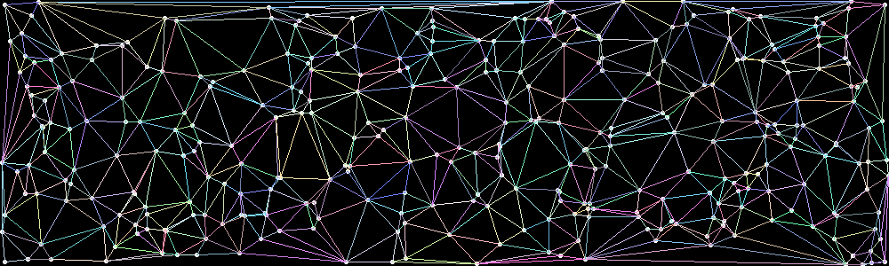

# Delaunay Triangulation

This repository implements the Bowyer-Watson algorithm for Delaunay Triangulation.

From [Wikipedia](https://en.wikipedia.org/wiki/Delaunay_triangulation):
> In computational geometry, a Delaunay triangulation or Delone triangulation of a set of points in the plane subdivides their convex hull into triangles whose circumcircles do not contain any of the points.   The triangulation is named after Boris Delaunay for his work "Sur la sphère vide" (On the empty sphere) from 1934.

The implementation is based on the pseudocode from the [Bowyer–Watson article on Wikipedia](https://en.wikipedia.org/wiki/Bowyer%E2%80%93Watson_algorithm#Pseudocode).
